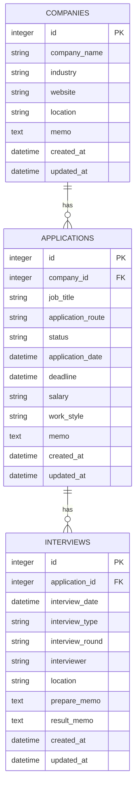

# JobTrack

JobTrackは、就職活動で検討している企業・応募情報・面接予定をまとめて管理する、個人向けのWebアプリケーションです。

企業ごとに求人への応募状況や対応期限を記録し、ダッシュボードから就職活動全体の進捗を確認できるようにすることを目的としています。


## 主な機能

### ダッシュボード

- 登録企業数の表示
- 選考中の応募件数の表示
- 今後予定されている面接件数の表示
- 内定件数の表示
- 最近登録した応募情報を最大10件表示
- 今後予定されている面接を日時順に表示

### 企業管理

- 企業一覧の表示
- 企業情報の新規登録
- 企業詳細の表示
- 企業情報の編集
- 企業情報の削除
- 企業ごとの応募情報一覧の表示

登録できる主な項目は次のとおりです。

- 企業名
- 業界
- 所在地
- Webサイト
- メモ

### 応募情報管理

- 企業に紐づく応募情報の新規登録
- 応募情報の詳細表示
- 応募情報の編集
- 応募情報の削除

登録できる主な項目は次のとおりです。

- 応募職種
- 選考状況
- 応募経路
- 応募日
- 対応期限
- 給与・待遇
- 勤務形態
- メモ

### 面接情報

- 応募情報に紐づく面接データモデル
- 今後の面接予定をダッシュボードに表示
- Flask CLIによるサンプル面接データの登録・削除

面接情報の登録・編集・削除画面は、今後実装する予定です。

## 使用技術

| 分類 | 技術 |
| --- | --- |
| Backend | Python, Flask 3.1 |
| ORM | Flask-SQLAlchemy 3.1 / SQLAlchemy 2.0 |
| Database | SQLite |
| Frontend | HTML, CSS, JavaScript, Jinja2 |
| UI | Bootstrap 5 |

## データベース設計



企業を削除すると、その企業に紐づく応募情報と面接情報もSQLAlchemyのカスケード設定によって削除されます。応募情報を削除した場合も、紐づく面接情報が削除されます。

## 画面とURL

| URL | 内容 |
| --- | --- |
| `/` | ダッシュボード |
| `/companies/` | 企業一覧 |
| `/companies/new` | 企業登録 |
| `/companies/<company_id>` | 企業詳細・応募情報一覧 |
| `/companies/<company_id>/edit` | 企業編集 |
| `/companies/<company_id>/applications/new` | 応募情報登録 |
| `/applications/<application_id>` | 応募情報詳細 |
| `/applications/<application_id>/edit` | 応募情報編集 |

削除処理は、各詳細画面などからPOSTリクエストで実行します。

## ディレクトリ構成

```text
.
├── app.py                    # アプリケーションファクトリ・初期設定
├── commands.py               # サンプルデータ用Flask CLIコマンド
├── constants.py              # 選考状況・応募経路・勤務形態などの定数
├── models.py                 # SQLAlchemyモデル
├── requirements.txt          # Python依存パッケージ
├── routes/
│   ├── dashboard.py          # ダッシュボード
│   ├── companies.py          # 企業CRUD
│   └── applications.py       # 応募情報CRUD
├── templates/
│   ├── base.html
│   ├── dashboard.html
│   ├── companies/
│   └── applications/
└── static/
    ├── css/
    └── js/
```

## セットアップ

### 1. リポジトリを取得

```bash
git clone <repository-url>
cd JobTrack-feature-application-crud
```

`<repository-url>`は、このリポジトリのURLに置き換えてください。

### 2. 仮想環境を作成

Windows PowerShellの場合：

```powershell
python -m venv .venv
.\.venv\Scripts\Activate.ps1
```

macOS・Linuxの場合：

```bash
python3 -m venv .venv
source .venv/bin/activate
```

### 3. 依存パッケージをインストール

```bash
pip install -r requirements.txt
```

### 4. アプリケーションを起動

```bash
flask --app app run --debug
```

ブラウザで次のURLを開きます。

```text
http://127.0.0.1:5000
```

初回起動時に、SQLiteデータベース `instance/JobTracker.db` と必要なテーブルが自動作成されます。

## サンプルデータ

Flask CLIコマンドで、動作確認用の企業・応募・面接データを登録できます。

データには依存関係があるため、次の順番で実行してください。

```bash
flask --app app seed
flask --app app seed-applications
flask --app app seed-interviews
```

サンプルデータを削除する場合は、参照関係を考慮して次の順番で実行します。

```bash
flask --app app clear-seed-interviews
flask --app app clear-seed-applications
flask --app app clear-seed
```

同じサンプルデータがすでに存在する場合、登録コマンドは重複を避けてスキップします。

## 設計上のポイント

- `create_app()`を使用したアプリケーションファクトリ構成
- 機能ごとにBlueprintを分割し、ルーティングの責務を整理
- SQLAlchemyによる企業・応募・面接のリレーション管理
- 親データ削除時の関連データをカスケード削除
- 日付が未入力の場合に`None`として保存できる入力処理
- 選考状況・応募経路・勤務形態を定数として一元管理
- Bootstrapと独自CSSによるレスポンシブな画面設計
- Flask CLIによる再実行可能なサンプルデータ作成

## 現在の制限事項

- ユーザー認証には未対応です。
- データはユーザーごとに分離されません。
- 面接情報の登録・編集・削除画面は未実装です。
- CSRF対策や詳細な入力値検証は未実装です。
- DBマイグレーション機能は未導入です。
- 自動テストは未導入です。
- SQLiteを使用しているため、大規模運用は想定していません。
- `SECRET_KEY`の初期値は開発用です。本番利用する場合は環境変数で安全な値を設定する必要があります。

## 制作目的

このアプリケーションでは、次の技術要素を実践することを目的としています。

- Flaskを用いたWebアプリケーション開発
- Blueprintによる機能分割
- SQLAlchemyを用いたCRUD処理
- リレーショナルデータベースの設計
- Jinja2によるテンプレート表示
- BootstrapとCSSを用いたUI実装
- Gitのブランチを利用した段階的な機能開発
