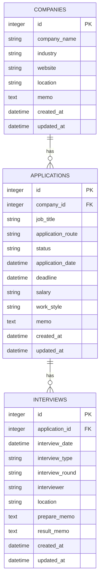

# JobTrack

JobTrackは、就職活動で検討している企業、求人への応募状況、面接予定をまとめて管理する個人向けWebアプリケーションです。

企業ごとの応募情報や対応期限を記録し、ダッシュボードから就職活動全体の進捗と今後の予定を確認できるようにすることを目的としています。

> [!NOTE]
> 本プロジェクトは、Flask・SQLAlchemyを用いたWebアプリケーション開発の学習およびポートフォリオ掲載を目的としています。現時点では、本番環境での業務利用や複数ユーザーでの利用を想定していません。

## 主な機能

### ダッシュボード

- 登録企業数の表示
- 選考中の応募件数の表示
- 今後予定されている面接件数の表示
- 内定件数の表示
- 最近登録した応募情報を最大10件表示
- 今後予定されている面接を日時順に表示

### 企業管理

- 企業一覧の表示
- 企業情報の新規登録
- 企業詳細の表示
- 企業情報の編集
- 企業情報の削除
- 企業ごとの応募情報一覧の表示

登録できる項目は次のとおりです。

- 企業名
- 業界
- 所在地
- Webサイト
- メモ

### 応募情報管理

- 企業に紐づく応募情報の新規登録
- 応募情報の詳細表示
- 応募情報の編集
- 応募情報の削除
- 応募情報に紐づく面接一覧の表示

登録できる項目は次のとおりです。

- 応募職種
- 選考状況
- 応募経路
- 応募日
- 対応期限
- 給与・待遇
- 勤務形態
- メモ

### 面接情報管理

現在、次の機能を実装しています。

- 応募情報に紐づく面接情報の新規登録
- 面接情報の詳細画面
- 今後の面接予定をダッシュボードに表示
- Flask CLIによるサンプル面接データの登録・削除

登録対象としている項目は次のとおりです。

- 面接日時
- 面接形式
- 面接段階
- 面接官
- 会場・オンライン会議URL
- 面接準備メモ
- 面接結果メモ

面接詳細画面の表示内容、面接情報の編集・削除機能は現在実装中です。

## 使用技術

| 分類 | 技術 |
| --- | --- |
| Backend | Python, Flask 3.1 |
| ORM | Flask-SQLAlchemy 3.1 / SQLAlchemy 2.0 |
| Database | SQLite |
| Template | Jinja2 |
| Frontend | HTML, CSS, JavaScript |
| UI | Bootstrap 5 |

## データベース設計



企業と応募情報は1対多、応募情報と面接情報も1対多の関係です。

企業を削除すると、その企業に紐づく応募情報と面接情報もSQLAlchemyのカスケード設定によって削除されます。応募情報を削除した場合も、紐づく面接情報が削除されます。

## 画面とURL

| URL | 内容 | 状況 |
| --- | --- | --- |
| `/` | ダッシュボード | 実装済み |
| `/companies/` | 企業一覧 | 実装済み |
| `/companies/new` | 企業登録 | 実装済み |
| `/companies/<company_id>` | 企業詳細・応募情報一覧 | 実装済み |
| `/companies/<company_id>/edit` | 企業編集 | 実装済み |
| `/companies/<company_id>/applications/new` | 応募情報登録 | 実装済み |
| `/applications/<application_id>` | 応募情報詳細・面接一覧 | 実装済み |
| `/applications/<application_id>/edit` | 応募情報編集 | 実装済み |
| `/applications/<application_id>/interviews/new` | 面接情報登録 | 実装中 |
| `/interviews/<interview_id>` | 面接情報詳細 | 実装中 |

企業と応募情報の削除処理は、詳細画面などからPOSTリクエストで実行します。

## ディレクトリ構成

```text
.
├── app.py                         # アプリケーションファクトリ・初期設定
├── commands.py                    # サンプルデータ用Flask CLIコマンド
├── constants.py                   # 選考状況・応募経路・面接形式などの定数
├── models.py                      # SQLAlchemyモデル
├── requirements.txt               # Python依存パッケージ
├── instance/
│   └── JobTracker.db              # SQLiteデータベース
├── routes/
│   ├── dashboard.py               # ダッシュボード
│   ├── companies.py               # 企業CRUD
│   ├── applications.py            # 応募情報CRUD
│   └── interviews.py              # 面接情報の登録・詳細表示
├── templates/
│   ├── base.html
│   ├── dashboard.html
│   ├── companies/
│   ├── applications/
│   └── interviews/
└── static/
    ├── css/
    │   ├── reset.css
    │   └── style.css
    └── js/
        └── main.js
```

## セットアップ

### 1. リポジトリを取得

```bash
git clone <repository-url>
cd JobTrack_Self
```

`<repository-url>`は、このリポジトリのURLに置き換えてください。

### 2. 仮想環境を作成

Windows PowerShellの場合：

```powershell
python -m venv .venv
.\.venv\Scripts\Activate.ps1
```

macOS・Linuxの場合：

```bash
python3 -m venv .venv
source .venv/bin/activate
```

### 3. 依存パッケージをインストール

```bash
pip install -r requirements.txt
```

### 4. アプリケーションを起動

```bash
flask --app app run --debug
```

ブラウザで次のURLを開きます。

```text
http://127.0.0.1:5000
```

初回起動時に、SQLiteデータベース `instance/JobTracker.db` と必要なテーブルが自動作成されます。

## サンプルデータ

Flask CLIコマンドを使用して、動作確認用の企業・応募・面接データを登録できます。

データには依存関係があるため、次の順番で実行してください。

```bash
flask --app app seed
flask --app app seed-applications
flask --app app seed-interviews
```

サンプルデータを削除する場合は、参照関係を考慮して次の順番で実行します。

```bash
flask --app app clear-seed-interviews
flask --app app clear-seed-applications
flask --app app clear-seed
```

同じサンプルデータがすでに存在する場合、登録済みのデータは重複を避けてスキップされます。

## 設計上のポイント

- `create_app()`を使用したアプリケーションファクトリ構成
- 機能ごとにBlueprintを分割したルーティング設計
- SQLAlchemyによる企業・応募・面接のリレーション管理
- 親データ削除時の関連データのカスケード削除
- 任意の日付項目を未入力時に`None`として保存する処理
- 選考状況・応募経路・勤務形態・面接形式を定数として一元管理
- Bootstrapと独自CSSによるレスポンシブUI
- 再実行可能なFlask CLIサンプルデータ作成コマンド

## 現在の制限事項

- ユーザー認証には対応していません。
- データはユーザーごとに分離されません。
- 面接情報の登録画面と詳細画面は実装途中です。
- 面接情報の編集・削除機能は未実装です。
- CSRF対策は未実装です。
- サーバー側の入力値検証は最低限の実装です。
- DBマイグレーション機能は未導入です。
- 自動テストは未導入です。
- SQLiteを使用しているため、大規模運用は想定していません。
- `SECRET_KEY`の初期値は開発用です。本番環境で利用する場合は、安全な値を環境変数に設定する必要があります。

## 今後の改善予定

- 面接情報の登録画面の完成
- 面接詳細画面への各項目の表示
- 面接情報の編集・削除機能
- 企業・応募情報の検索、絞り込み、並び替え
- 対応期限が近い応募情報の警告表示
- 面接予定のカレンダー表示
- Flask-Loginによるユーザー認証とデータ分離

## 制作目的

このアプリケーションでは、次の技術要素を実践することを目的としています。

- Flaskを用いたWebアプリケーション開発
- Blueprintによる機能分割
- SQLAlchemyを用いたCRUD処理
- リレーショナルデータベースの設計
- Jinja2による動的な画面表示
- BootstrapとCSSを用いたUI実装
- Gitのブランチを利用した段階的な機能開発
